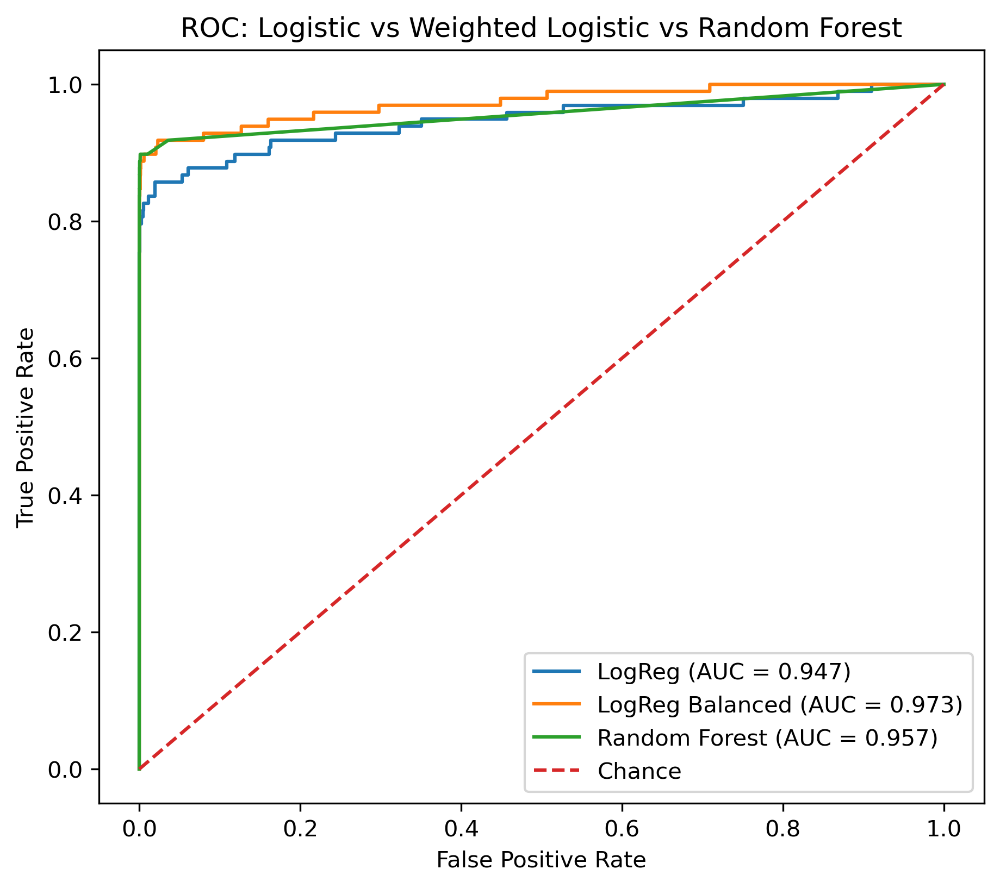

# Credit Card Fraud Detection Project

This is a small project where I tried to build a model that can spot fraudulent credit card transactions. The dataset comes from Kaggle
and contains ~285,000 transactions, out of which only 492 are frauds (~0.17%).

That huge imbalance makes the problem interesting: the model has to learn how to catch rare frauds.

  - In the data set, there are:
    - About 285k rows (one for each transaction)
    - 31 columns
        - PCA-anonymized features labeled as V1-V28
        - Time and Amount
        - Target (Class, 0= legit and 1=fraud)

  - Initial model: Logistic regression: For legit transactions, it worked almost at 100% accuracy (with a 0.5 threshold), for fraud, it did poorly at 67%. Accuracy looked perfect, but it was misleading as the data is imbalanced towards the legitimate cases.
  - In order to handle the class imbalance, I added class_weight="balanced", which assigned a higher weight to fraud, i.e., every time it misclassifies a fraud, the loss/error is multiplied by a bigger weight. This increased the fraud detection to ~92%, but the precision dropped due to increased false alarms.
  - Random Forest model: Trained a random forest with 200 trees. I obtained high recall and improved precision compared to weighted logistic regression, with an AUC of around 0.98.
  - Feature Importance: Random Forest highlighted V14, V12, V17, and Amount as the most important signals for detecting fraud.
  
  - Results
      - ROC Curves
  
      - Feature Importance
  

- What I learned:
  - Accuracy is useless on imbalanced data. Precision, recall, and AUC tell the real story.
  - Logistic Regression is a solid baseline, but it struggles with rare classes.
  - Random Forests are much more powerful here, and feature importances help explain what dves fraud detection.
  - There’s always a trade-off: higher recall means catching more frauds but annoying more customers with false alarms.
    
- Tech Stack
   - Python, pandas, scikit-learn, matplotlib
   - Models: Logistic Regression, Random Forest
   - Evaluation: Precision, Recall, F1-score, ROC/AUC

