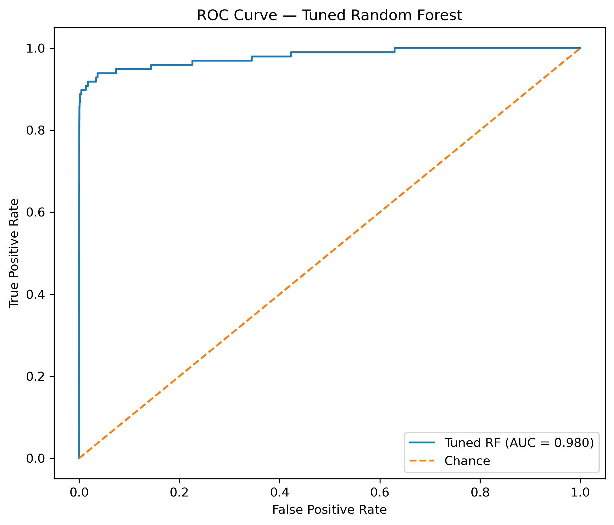

# Credit Card Fraud Detection Project

This is a small project where I tried to build a model that can spot fraudulent credit card transactions. The dataset comes from Kaggle
and contains ~285,000 transactions, out of which only 492 are frauds (~0.17%).

That huge imbalance makes the problem interesting: the model has to learn how to catch rare frauds.

  - In the data set, there are:
    - About 285k rows (one for each transaction)
    - 31 columns
        - PCA-anonymized features labeled as V1-V28
        - Time and Amount
        - Target (Class, 0= legit and 1=fraud)
# First Act
  - Initial model: Logistic regression: For legit transactions, it worked almost at 100% accuracy (with a 0.5 threshold), for fraud, it did poorly at 67%. Accuracy looked perfect, but it was misleading as the data is imbalanced towards the legitimate cases.
  - In order to handle the class imbalance, I added class_weight="balanced", which assigned a higher weight to fraud, i.e., every time it misclassifies a fraud, the loss/error is multiplied by a bigger weight. This increased the fraud detection to ~92%, but the precision dropped due to increased false alarms.
  - Random Forest model: Trained a random forest with 200 trees. I obtained high recall and improved precision compared to weighted logistic regression, with an AUC of around 0.98.
  - Feature Importance: Random Forest highlighted V14, V12, V17, and Amount as the most important signals for detecting fraud.
  
  - Results
      - ROC Curves
  
      - Feature Importance
  

- What I learned:
  - Accuracy is useless on imbalanced data. Precision, recall, and AUC tell the real story.
  - Logistic Regression is a solid baseline, but it struggles with rare classes.
  - Random Forests are much more powerful here, and feature importances help explain what dves fraud detection.
  - There’s always a trade-off: higher recall means catching more frauds but annoying more customers with false alarms.
    
- Tech Stack
   - Python, pandas, scikit-learn, matplotlib
   - Models: Logistic Regression, Random Forest
   - Evaluation: Precision, Recall, F1-score, ROC/AUC

# Second Act:

- Fine-tuning RF model: I tuned a Random Forest using `GridSearchCV` with a stratified 5-fold split (keeps the fraud/legit ratio consistent in each fold).
- **Base model:** `RandomForestClassifier(class_weight="balanced", n_jobs=-1, random_state=42)`
- **Search space (16 combos; 5 folds → 80 fits):**
  - `n_estimators`: [100, 200]
  - `max_depth`: [8, 12]
  - `min_samples_split`: [2, 5]
  - `min_samples_leaf`: [1, 2]
  - `max_features`: ["sqrt"]
- **Scoring:** optimized for **ROC AUC**; also tracked **Average Precision (PR-AUC)**.
- After the search, `GridSearchCV` refit the best model on the full training set and I evaluated on the held-out test set.

### Why this matters
- Grid search removes guesswork by testing all parameter combinations on multiple folds.
- Stratified CV avoids “unlucky” splits with too few fraud cases.
- Reporting both ROC AUC and PR-AUC is important for highly imbalanced data.

## Results (Tuned Random Forest)

- Test **ROC AUC**: ~0.98  
- Test **PR-AUC (Average Precision)**: ~0.80  
- Full precision/recall/F1 by class is printed in the notebook’s `classification_report`.

Plots saved in `images/`:
- ROC Curve — Tuned Random Forest  
  `images/roc_curve_best_rf.png`  
  

- Precision–Recall Curve — Tuned Random Forest  
  `images/precision_recall_best_rf.png`  
  

### Interpretation (brief)
- **ROC AUC ~0.98** indicates excellent ranking ability (fraud vs. non-fraud).
- **PR-AUC ~0.80** shows strong performance on the rare positive class (fraud), which is the metric that matters most when positives are scarce.

### How to reproduce
1. Run the “Fine-tuning RF (GridSearchCV)” cell in the notebook.  
2. The cell prints the best hyperparameters and test metrics.  
3. It also writes the plots above to `images/` so they render in this README.
